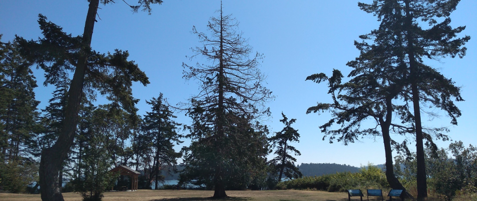

```{r setup, include=FALSE}
knitr::opts_chunk$set(echo = FALSE)
```



# Project Status: Unfunded

This project is not yet funded. 

# Introduction

Western redcedar is a critical species for Pacific Northwest communities and environments, but there is growing concern about its continued existence for future generations. Increased levels of dieback have been observed throughout the region and there is growing evidence for a link between the dieback and our region's recent longer and hotter summer droughts. More research is urgently needed to conserve and explore the genetic diversity of western redcedar to find solutions and preserve it for future generations.

# Purpose

If funded, the purpose of this project would be to explore the genetic diversity of western redcedar as a potential solution for sustaining it into the future.

# Approach

Multiple land owners, managers and stewards have expressed support for hosting genetic diversity trials to serve as sites for a common garden study. Research support is needed for staff time to organize seed collection, seedling propagation, site prep, planting and monitoring.

* General Approach
  + Evaluate diversity within existing seed orchards / mixed populations
  + Collect cones from western redcedar grown throughout its range (Latitudinal from Northern California to Alaska, and Longitudinal from Vancouver Island to Western Montana), then extract seed, evaluate and quantify seed midge damage. 
  + Propagate seedlings uniformly (WSU Puyallup Research and Extension Center is ideal location)
  + Identify/select common garden sites
  + Prep sites for planting (brush removal, fences to prevent wildlife browse)
  + Monitor seedling physiology, growth, mortality, disease prevalence, and more (Annually at least). 

# Impact


# Needs

The greatest need is funding to cover staff time for organizing the project. 

* General Funding Needs 
  + Project director
  + Compensation for seed collectors - could leverage community scientist support in [Forest Health Watch](https://foresthealth.org/)
  + Collecting seed from existing orchards or trees produced for known seed zones
  + Seed extractor costs
  + Seedling propagation costs - materials and space for propagation
  + Site preparation costs - e.g. building fences in high browse areas
  

