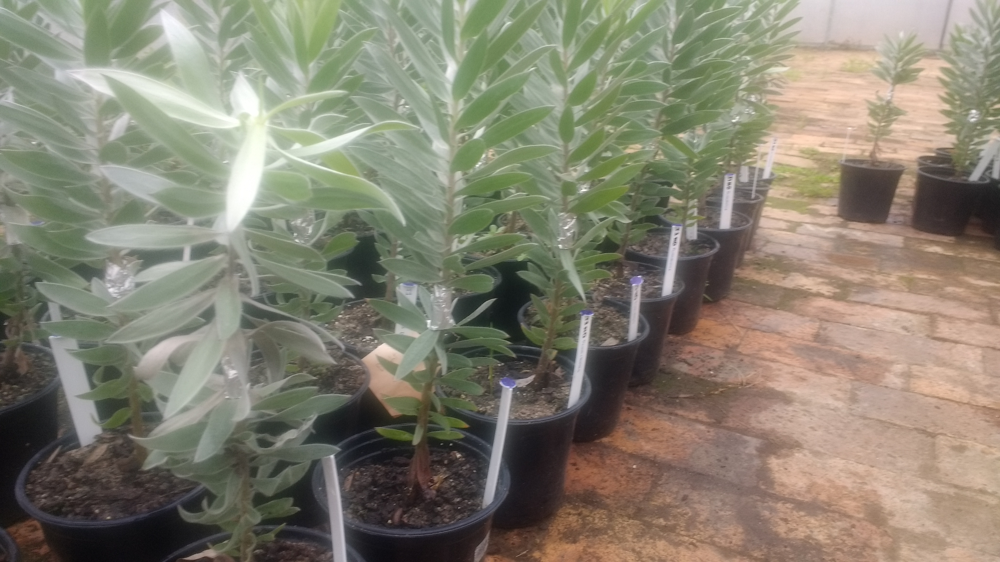

* Workshop Series
    + [Home](http://jmhulbert.github.io/r/bio/)
    + [Session 1](http://jmhulbert.github.io/r/bio/s1)

```{r message=FALSE, warning=FALSE, include=FALSE}
library(knitr)
library(tidyverse)
```

# Introduction

Below are two links to a mock dataset that we can learn with during the RStudio and R package workshop series. 

# The Experiment

The mock data represents data from an experiment we conducted to evaluate the cumulative effects of drought and pathogen infeciton on an endemic and endangered species. 



Trees were split into trails and treatments and infected with one of two pathogen species. We also included controls that were not inoculated. Below is a quick summary of the experimental design. 

```{r include=FALSE}
data <- read.csv("Silver Tree Study.csv")
summary <- data %>% filter(Species!="Both Pathogens") %>% group_by(Trial,Treatment,Species) %>% summarise("Number of Plants"=n_distinct(Plant.Number))
```


```{r echo=FALSE}
kable(summary,align='c')
```

We will learn to produce summary tables like the one above in [Session 3-Introduction to dplyr](http://jmhulbert.github.io/r/fabi/s3).

We measured the physiological response of the plants using some fancy equipment. At least 10 measurements were made on each plant 2-3 times a week for one month. 


# The Data

* The mock data is available below in two formats
    + [.csv version](./Silver Tree Study.csv)
    + [.xlsx version](./Silver Tree Study.xlsx)


# Vegan Session Data

 * Below is a sample dataset that we will use for [Session 4](http://jmhulbert.github.io/r/fabi/s4).
    + [Forest Understory Species.csv](./Forest Understory Species.csv)


