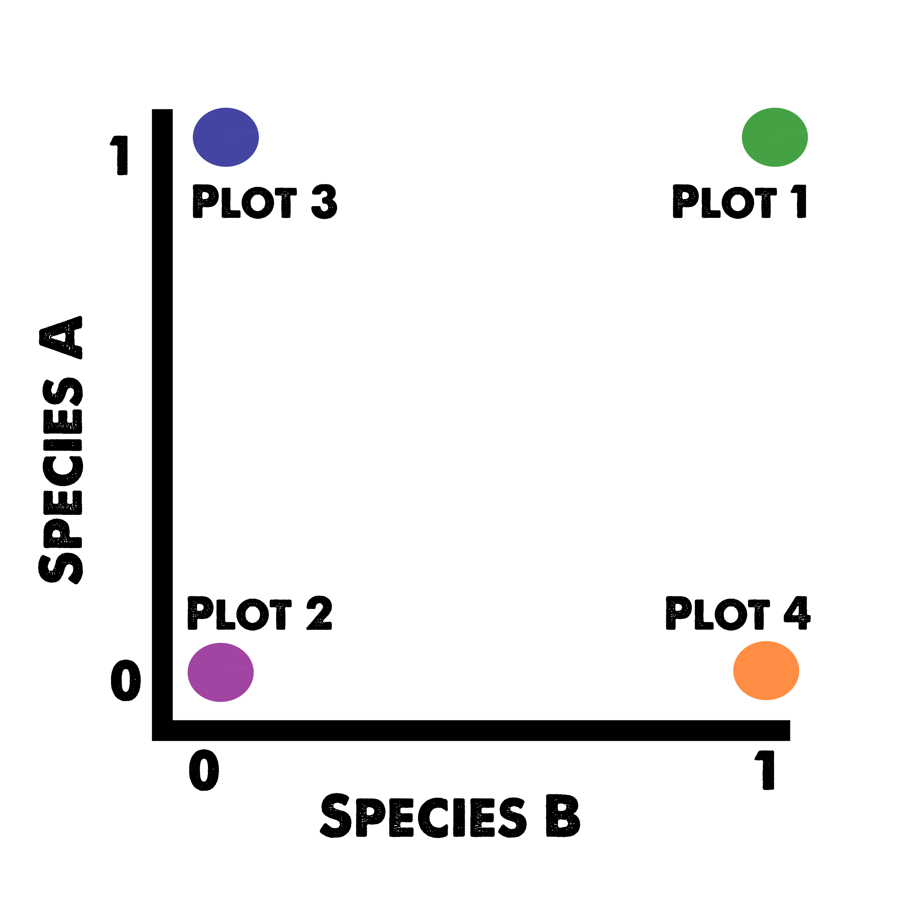

<script>
    $(document).ready(function() {
      $items = $('div#TOC li');
      $items.each(function(idx) {
        num_ul = $(this).parentsUntil('#TOC').length;
        $(this).css({'text-indent': num_ul * 10, 'padding-left': 0});
      });
    });
</script>

```{r setup, include=FALSE}
knitr::opts_chunk$set(echo = TRUE)
```

```{r include=FALSE}
library(knitr)
```

[FABI Workshop Series >> Home](http://jmhulbert.github.io/r)
[FABI Workshop Series >> Mock Data](http://jmhulbert.github.io/r/data)


# Introduction

Welcome to the guide for the fourth session of our workshop. The purpose of this page is to provide an introduction to the [vegan package](https://www.rdocumentation.org/packages/vegan/versions/2.4-2) and provide an example of a multivariate analysis. 


## The data

I have added a .csv file to the mock data page that we can use as an example for this session. The dataset contains presence/absence data for species in the understory of 4 forest fragments. 


## Index package libraries

```{r}
library(tidyverse)
library(vegan)
```


## Import Data

```{r}
understory <- read.csv("Forest Understory Species.csv")
```


The data is organized in rows of forest plots and columns of variables that indicate if each species was present (multivariate). 

```{r}
as_tibble(understory)
```

## rename column

The column 'Tree.Number' is really the plot number. We can change the name of the column using dplyr, the package we learned about in [Session 3](http://jmhulbert.github.io/r/s3). 

```{r}
understory <- rename(understory,Plot=Tree.Number) #rename is a command in the dyplr package we loaded with the tidyverse.
```

Check that the column was renamed. 

```{r}
names(understory[c(1:15)]) #the [c(1:15)] tells r to only list the first 15 columns.
```

## Distinguish explanatory and response variables

Here we can divide our data into explanatory and response variables. The species data in the mock dataset is our response variables, and the site/forest/rainfall data are our explanatory variables. 

```{r}
response <- understory[-c(1:4)] #here we are selecting only the species data columns
explanatory <- understory[c(1,2,3,4)] #here we are selecting only the site data columns
```


```{r}
names(explanatory)
```

# Question of Interest

Lets use multivariate analysis to determine if the understory species compoisition is different for each forest. 

**We hypothesize each forest will have distinct understory communities.**


# Multivariate Analysis

Multivariate analysis is a way to compare groups of data by representing each sampling unit as a point in a multidimensional space, and then calculating the distances between points.

For example, imagine if you have two species, one represented on the y axis and one represented on the x axis. Now imagine that you have two tick marks on each axis -- a 0 for species absence, and a 1 for species presence. Now imagine where the following plots would be placed in 2 dimensions. 

* Species composition of plots
    + Plot 1 (Species A and Species B present)
    + Plot 2 (Neither species present)
    + Plot 3 (Only Species A present)
    + Plot 4 (Only Species B present)



Now imagine where the plots would be if we added another species (another dimension), or 10 more species. 

## Distance measures

There are many different distance measures (as many as 26) that can be used to calculate disseminilary between plots or groups of plots. Each measure is caclualted differently and has different assumptions so it is important to understand which one is most appropriate for your dataset. 

### Jaccard dissimilarity 

The Jaccard disseminilarity measure is commonly used with presence/absence data. 

### Bray-Curtis distance 

The Bray-Curtis distance measure is commonly used with abundance data. 

We will use the Jaccard disseimilarity measure in this session because our understory data is presence/absence data. 


## Ordination

We can use ordination to visualize patterns in the data (e.g. clustering), but we will need to use statistics to actually reveal whether the predefined groups (forests) have distinct communities within the plots. 


First we need to decide what type of Ordination we want to use to visualize the data. 

* Here we can consider two types
    + Principal components analysis (PCA)
    + Nonmetric multidimensional scaling (NMDS)
    
### NMDS
Lets look at our data using NMDS

First we need to calculate the distance measures

```{r}
distance <- metaMDS(response,distance="jaccard",binary=TRUE)
```


```{r}
distance
```

Now we can plot the metamds values 

```{r}
plot(distance,type="n") #this draws a blank plot
points(distance,display="sites") #this adds our plots
```

Ok, there are our 61 plots represented as points in a multi-dimensional space. 

We can also look to see where the species occur, and which species may be influncing the positions of the plots

```{r}
plot(distance,type="n") #this draws a blank plot
points(distance,display="sites") #this adds our plots
text(distance, display="species",cex=0.7, col="blue") #this adds text for our species
```

#### Grouped by Forest


Now lets investigate whether the plots are clustered based on forest. We can ask R to draw polygons that indicate where the group centroids would be if run 100 times (95% of the time). 

```{r}
plot(distance,type="n") #this draws a blank plot
points(distance,display="sites") #this adds our plots
ordiellipse(distance,explanatory$Forest,kind="se",conf=0.95,draw="polygon",col=c(1:4),label=TRUE)
```

We may also want to have a legend instead of the labels because they overlap. For this we first need to create a legend object.


```{r}
legend.labels <- c("GrootVadersBos","Kleinbos","Witelsbos","Woodville")

plot(distance,type="n") #this draws a blank plot
points(distance,display="sites") #this adds our plots
ordiellipse(distance,explanatory$Forest,kind="se",conf=0.95,draw="polygon",col=c(1:4),label=FALSE) #this time label is set to FALSE
legend(0.8,1.0,col = 1:4,legend=legend.labels, pt.bg = 1:4, bty = "n", pch = 21)

```

We can also add lines to indicate the center of the groups and identify each plot.

```{r}
plot(distance,type="n") #this draws a blank plot
points(distance,display="sites") #this adds our plots
ordiellipse(distance,explanatory$Forest,kind="se",conf=0.95,draw="polygon",col=c(1:4),label=FALSE) #this time label is set to FALSE
ordispider(distance,explanatory$Forest,col=c(1:4),label=FALSE)
legend("topright",col = 1:4,legend=legend.labels, pt.bg = 1:4, bty = "n", pch = 21)
```

Well it looks like our forests have distinct plant communities. There is some similarity between Kleinbos and Woodville, but GrootVadersBos and Witelsbos look fairly distinct.


#### Grouped by Focal Tree

Just for fun, we can look to see if the understory species are grouped based on the overstory (focal tree) species as well. 

I noticed that there was an extra capital letter in one of species in a few observations so we need to change it so those plots are grouped together. 

```{r}
explanatory<- explanatory%>% mutate(Focal.Tree = recode(Focal.Tree, "Olea Capensis subsp. macrocarpa"="Olea capensis subsp. macrocarpa"))
```


This is the same, except now we have 5 groups.

```{r}
plot(distance,type="n") #this draws a blank plot
points(distance,display="sites") #this adds our plots
ordiellipse(distance,explanatory$Focal.Tree,kind="se",conf=0.95,draw="polygon",col=c(1:5),label=TRUE) #label = true, colors set to 5.
ordispider(distance,explanatory$Focal.Tree,col=c(1:5),label=FALSE)
```

```{r}
focal.legend <- c("Cunonia capensis","Olea capensis subsp. macrocarpa","Olinia ventosa","Podocarpus latifolius","Rapanea melanophloeos")
```

```{r}
plot(distance,type="n") #this draws a blank plot
points(distance,display="sites") #this adds our plots
ordiellipse(distance,explanatory$Focal.Tree,kind="se",conf=0.95,draw="polygon",col=c(1:5),label=FALSE) #label = true, colors set to 5.
ordispider(distance,explanatory$Focal.Tree,col=c(1:5),label=FALSE)
legend("topleft",col = 1:5,legend=focal.legend, pt.bg = 1:5, bty = "n", pch = 21)
```

Here it looks like *Cunonia capensis* and *Olea capensis* subsp. *macrocarpa* have distinct communities. 


## Permutation based statisitics

### PERMANOVA

ANOVAs are commonly used techniques to test for differences in mean values between groups. The test generally compares within group variation to the between group variation. If you have greater variation between the groups than within the groups, you have evidence that **at least one** of the groups is different. 

We can apply the same concept to our distance data and compare the mean distances within groups to the mean distances between groups. Here we use permutations to get the means. We can indicate we want 9999 permutations, which essentially recalculates the distances for each plot 9999 times using different axis and allowing the points to vary in space. 


#### Grouped by Forest

```{r}
permanova <- adonis2(response~Forest,perm=9999,method="jaccard",binary=TRUE,data=explanatory)
permanova
```

Ok, here we have strong evidence that the species composition differs between forests. But which forests differ from each other? To answer this, we have to do pairwise contrasts. 

#### Grouped by Focal Tree

```{r}
permanova <- adonis2(response~Focal.Tree,perm=9999,method="jaccard",binary=TRUE,data=explanatory)
permanova
```

Neat, we also have evidence that the species composition differs between focal trees.  

There is a function to add pairwise comparisons, but I haven't been able to get it working yet.

```{r eval=FALSE}
install.packages('devtools')
library(devtools)
install_github("pmartinezarbizu/pairwiseAdonis/pairwiseAdonis")
```

The other option is to make a model matrix for the contrasts we're interested in. 

